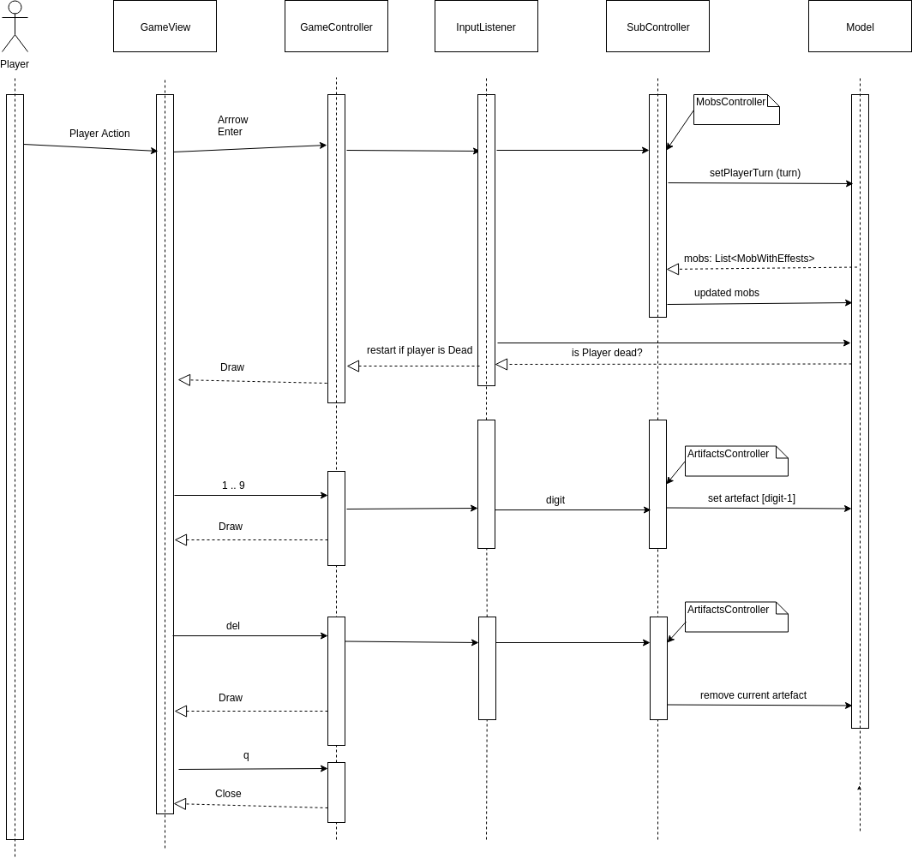
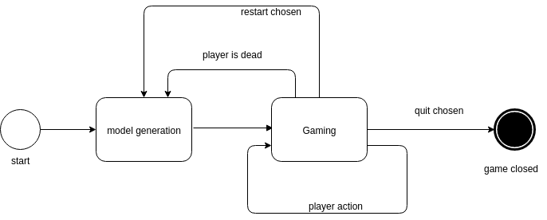

## Roguelike

##### Общие сведения о системе

Roguelike -- игра с консольной графикой, управлением с клавиатуры.

Компоненты игры:

* Подземелье: лабиринт с комнатами, стенами, тропинками между комнатами 

* Мобы: способные действовать (перемещаться/атаковать) противника персонажи.
  
  Мобы могут атаковать только других мобов, находящихся в соседней клетке; могут перемещаться только в соседнюю, незанятую клетку.
  
  Может выбрать 1 артефакт из своего хранилища артефактов. В таком случае, на моба действует эффект выбранного артефакта. 
  
  Может удалять артефакты из своего хранилища 
  
  Один mob управляется игроком. Остальные мобы -- враги, каждый из них управлятся рандомизированным алгоритмом.
  
* Обычный Бой:

Пусть **mob** атакует **victim**, тогда hp **victim** уменьшается на max(0, **mob.attack** - **victim.defence**)

Если **victim** погибает после атаки, **mob** забирает артефакты у **victim** и пытается ими дозаполнить своё хранилище. 

* Артефакты

    * Knife -- увеличение attack моба
    
    * Helmet -- увеличение defence моба 

    * Freezer -- действие обычного удара с некоторой вероятностью заменяется на обездвиживание противника на несколько ходов.

### Управление 
* перемешение -- стрелками (если хотим переместиться в моба, то атакуем его)
* enter -- пропустить ход
* сметнить/выбрать артифакт -- нажать соотв. цифру (например, выбрать второй артифакт, нажать 2) 
* del -- удалить выбраный артифкт
* q -- выход
* r -- начать заново 

#### Architectural drivers

* выбрана платформа jvm, т.к. хочется, чтобы игра была кроссплатформенной

альтентатива .net подоходит меньше из-за отсутвия опыта использования   

* язык kotlin

альтернативы: java, scala

* мобы противника сами (вызовом метода turn) определяют что им делать. так сделано, чтобы разработчик старался сделать мобов "честными".

* эффект добавляется с помошью шаблона декоратор, предполагается, что так можно реализовать очень широкий набор эффектов

* выбрана генерация карты с использованием сторонней библиотеки

альтернативы:

  * загрузка карты из файла -- не похоже на канонический рогалик

  * генерация своим алгоритмом

##### Роли и случаи использования

В игре есть 1 роль игрок. Использовать можно, чтобы занять своё время игрой.

###### Варианты целей

* Убить всех врагов

* Погибнуть за наименьшее / наибольшее число шагов

* Исследовать всё поле

* Попробовать все артефакты

* ...

#### Диаграмма компонентов

* Model -- состояние игры

* View -- визуализация / получение действий пользователя

* Controller -- выполняет действия пользователя

* MobCore -- примитивы для реализации мобов

* Actions -- действия, которые моб может попросить выполнить

* Artifacts -- хранилища артифактов

* Effects -- эффекты, с помощью которых можно изменить характеристики моба 

#### Диаграмма классов

##### Компонента mob

`MobWithEffects` -- интерфейс моба, используемого в модели игры. 
Чтобы создать объект такого типа, можно отнаследоваться от `MobDecoratorCombiner`. Также, чтобы выбранный артифакт из storage работал, надо добавить эффект `StorageEffect()` этому мобу.

`MobFactory` -- фабрика мобов: с помощью неё можно создавать "готовых" мобов.

`PlayerMobWithEffects` -- интерфейс моба игрока: ему можно указать, что делать на следущем ходу.

`Action` -- итерфес для действия, которое моб просит сделать.
* `Rest()` -- ничего не делать
* `Move(posTo)` -- переместиться в posTo 
* `HitAction(victim)` -- интерфес для действия атаки на victim

  * `HitSibling(victim)` -- атаковать victim обычным ударом
  
  * `FreezeSibling(victim)` -- попытаться заморозить victim на несколько шагов

`Effect` -- интерфейс для эффекта. Чтобы создать какой-нибудь эффект можно отнаследоваться `EffectImpl`.

`Artifact` -- класс для артефакта

`ArtifactsStorage` -- интерфейс для хранилища артефактов моба.

##### Компонента Model

`Model` -- Интерфес для модели игры. 
Можно добавять мобов или удалять оттуда. Обновлять позиции мобов после их пермешения.
Также можно получить моба игрока, число совершённых ходов, узнать, что находится в такой-то клетке поля.   

`generateField(n,m)` -- функция генерации игрого поля в виде подземелья.

`generateMobs(field, density)` -- функция генерации мобов на игровом поле [field] с долей места занимаего мобами [density].

`ModlelImpl` -- реализация интерфейса model.

#### Взаимодействия и Состояния

##### Диаграмма последовательностей

Описывает происходящее в `GameController` после действия пользователя. 

##### Диаграммы состояния

###### Диаграмма состояния GameController

#### Зависимости

`czyzby:noise4j` -- генерация карты

`zircon` -- для рисования терминала, получения действий пользователя

`junit`, `hamcrest` -- для юнит-тестов

`kotlin-logging` -- логирование 

